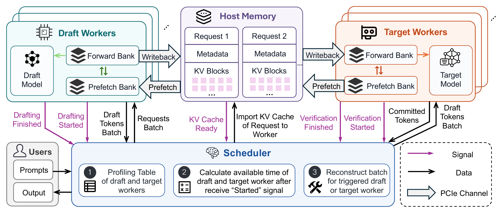

# NebulaSD: Many-for-Many Speculative Decoding

**Independent Draft and Target pools. Dynamic batch reconstruction. Overlapped KV-state preparation.**

NebulaSD is a research system for **many-for-many (M-for-N) speculative decoding**. It organizes M Draft workers and N Target workers into independently schedulable resource pools. Requests can move between workers within each pool, and batches are reconstructed separately at each stage, allowing drafting and verification to use different batch sizes and share capacity across concurrent requests.

[](nebulasd/figs/architecture3.pdf)

[Design](#how-it-works) · [Quickstart](#quickstart) · [Python API](#python-api) · [Documentation](#documentation-and-code)

## Why many-for-many?

Drafting and verification have different service characteristics: a lightweight Draft model and a larger Target model need not reach their best efficiency at the same batch size. Fixed Draft–Target pairs keep spare capacity local to each pair. Physically separating the two stages still leaves this constraint in place if requests or batches retain fixed affinities.

NebulaSD removes both fixed worker assignment and cross-stage batch affinity. Requests drafted together can be verified in different batches, and a request can use a different same-role worker in its next round. The scheduler coordinates this flexibility with KV-state preparation so that moving a request does not have to put all state-transfer work on the execution critical path.

## How it works

1. **Pool requests across workers.** The Engine admits tokenized requests and maintains their progress. Draft workers propose candidate tokens; Target workers verify them and publish committed output. Each request follows the dependency `Draft(q) → Target(q) → Draft(q+1)`.
2. **Reconstruct each upcoming batch.** Worker progress and resource availability trigger scheduling. Measured compute and transfer costs help predict predecessor completion, destination availability, and KV readiness. Draft and Target batches are selected independently from their stage's shared request pool.
3. **Prepare state ahead of execution.** Persistent HostKV stores Draft and Target states in separate pinned-memory arenas. Same-role workers restore the required state, write back changed KV ranges, and alternate two GPU banks to overlap preparation with computation.
4. **Execute when dependencies are ready.** Predictions guide planning; actual input, KV, and worker readiness gate execution. Shared-memory facts and eventfd notifications connect the Engine to workers, while completion records distinguish available output from physical resource retirement.

The Python control plane owns admission, scheduling, and shared state; the canonical [`swiftLLM`](swiftLLM/README.md) backend executes model operations. Each logical worker normally has separate control, execution, and DMA processes. **2D2T means two Draft GPU workers and two Target GPU workers on four GPUs**, with additional CPU processes.

For implementation details, see [scheduling](nebulasd/docs/current/SCHEDULER.md), [KV ownership and transfers](nebulasd/docs/current/KV.md), and the [worker runtime](nebulasd/docs/current/WORKER.md).

## Quickstart

### 1. Prepare the environment

The validated public preset requires:

- **Linux and four NVIDIA RTX 4090 GPUs (24 GiB each)**, using FP16 Qwen3-0.6B as Draft and Qwen3-8B as Target.
- **Python 3.10, a CUDA 12.8 toolkit with `nvcc`, and a compatible C++ compiler.** CUDA IPC, eventfd, and POSIX shared memory are required.
- **Sufficient shared and pinned host memory.** The default benchmark reserves 24,576 HostKV blocks per model, about **96 GiB for the two host KV arenas alone**, plus model-loading and pinned-buffer space. Containers need corresponding `/dev/shm` and locked-memory allowances.
- Local model directories containing config and weights, with compatible token IDs/tokenizers. Model weights are not included or downloaded automatically.

From the repository root, in your Python environment:

```bash
python -m pip install torch==2.11.0 --index-url https://download.pytorch.org/whl/cu128
python -m pip install -r nebulasd/requirements-runtime.txt
python -m pip install -e ./swiftLLM
python -m pip install --no-build-isolation -e ./swiftLLM/csrc
python -m pip install -e './nebulasd[test]'
```

The recorded environment uses PyTorch `2.11.0+cu128`, Triton `3.6.0`, Transformers `5.12.1`, Safetensors `0.8.0`, NumPy `2.2.6`, and Ray `2.55.1`. The PyTorch wheel does not supply the complete CUDA build toolchain. Use this repository's `./swiftLLM`; GPU entry points print and assert that both `swiftllm.__file__` and `swiftllm.server.starsd_target_facade.__file__` resolve inside it.

### 2. Run a small GPU smoke test

```bash
DRAFT_MODEL_PATH=/models/Qwen3-0.6B \
TARGET_MODEL_PATH=/models/Qwen3-8B \
CUDA_VISIBLE_DEVICES=0,1,2,3 \
bash nebulasd/examples/run_2d2t.sh --requests 8 --tokens 16 --warmup-repeats 0
```

This still requires the same models and four GPUs. The launcher builds the CPU native library, validates the cost table, runs the workload, waits for physical retirement, and checks worker exit codes.

### 3. Run the public benchmark

```bash
DRAFT_MODEL_PATH=/models/Qwen3-0.6B \
TARGET_MODEL_PATH=/models/Qwen3-8B \
CUDA_VISIBLE_DEVICES=0,1,2,3 \
bash nebulasd/examples/run_2d2t.sh
```

Defaults are **512 requests × 128 generated tokens**, Draft batch 64, Target batch 16, proposal depth 4, and two resident warmups. Set `PYTHON` to select an interpreter and `OUTPUT_DIR` to select a new output directory. The launcher resolves repository paths independently of the working directory.

The bundled cost table is a **recorded RTX 4090/Qwen3 calibration**. The launcher rebinds local model paths and checks model config hashes, backend source identity, GPU type, PyTorch/CUDA versions, and layout before starting model workers. Other environments need a compatible measured table supplied through `BACKEND_COST_TABLE`; automatic recalibration is not included. See [calibration provenance and format](nebulasd/examples/cost_tables/README.md).

### 4. Inspect the output

Results are written under `outputs/2d2t-*`:

| Artifact | Contents |
| --- | --- |
| `run.log` | Build, validation, execution, and shutdown log |
| `cost-table.json` | Validated calibration with resolved model paths |
| `run/report.json` | Warmup and timed-run metrics, output tokens, and steady-window validity |
| `run/configuration.json`, `run/source-manifest.json` | Run configuration and source/native identity |
| `run/commands.json`, `run/output-chunks.json` | Issued work and delivered output chunks |
| `run/pids.json`, `run/exitcodes.json` | Worker process identities and shutdown status |

Timed throughput excludes model loading, warmup, and final retirement. Only interpret steady-state metrics when `steady.valid` is true. Synthetic prompts and fixed-length completion checks validate execution; independent Target-reference checks are provided separately in [GPU acceptance](nebulasd/tests/README.md).

## Python API

```python
from nebulasd import create_engine, NebulaSDConfig, GenerationConfig
```

Applications supply token IDs and drive the Engine from its owner thread:

| Method | Purpose |
| --- | --- |
| `submit(prompt_token_ids, generation_config)` | Admit a request and return its handle |
| `poll()` / `stream(handle)` | Advance execution; `stream` also yields the request's events |
| `read(handle)` / `result(handle)` | Read buffered events or completed token IDs |
| `drain()` / `close()` | Wait for retirement or shut down workers and resources |

Startup requires explicit completion scheduling, stagewise placement, a compatible cost table, and appropriately sized resources. Use a guarded `if __name__ == "__main__":` entry point for multiprocessing and always close the Engine. See the [application configuration guide](nebulasd/docs/current/OPERATIONS.md) and [API semantics](nebulasd/docs/current/ENGINE.md).

## Documentation and code

| Component | Responsibility |
| --- | --- |
| [Python runtime](nebulasd/src/README.md) | Engine, scheduler, shared state, IPC, KV, and workers |
| [CPU native implementation](nebulasd/csrc/README.md) | Shared-memory primitives and scheduling kernels |
| [SwiftLLM backend](swiftLLM/README.md) | Vendored and modified GPU inference backend |
| [Examples](nebulasd/examples/README.md) | Public benchmark, warmup policy, and metrics helpers |
| [Tests](nebulasd/tests/README.md) | CPU/protocol tests and explicit GPU acceptance |
| [Architecture documentation](nebulasd/docs/current/README.md) | Engine, scheduling, workers, KV, and protocol contracts |
| [Release validation](nebulasd/docs/PUBLIC_RELEASE.md) | Recorded packaging and execution checks |

To build the CPU native library and run the test suite in the prepared environment:

```bash
python nebulasd/tools/build_native.py --output build/libstarsd.so
STARSD_NEXT_NATIVE_LIBRARY="$PWD/build/libstarsd.so" python -m pytest nebulasd/tests
```

The Python package and distribution are named `nebulasd`. Native symbols and `STARSD_*` environment variables retain their existing names, including `STARSD_NEXT_NATIVE_LIBRARY`.

## Current scope

This release is a single-node research system. Active-request cancellation is not implemented, and normal cohort reclamation restarts worker model processes; resident benchmark warmups defer that reclamation. Other model/hardware combinations require calibration and independent validation. Transparent crash recovery and long-running service behavior are not comprehensively validated. See [known limitations](nebulasd/docs/current/KNOWN_ISSUES.md).

## License and attribution

Parts of NebulaSD’s inference backend are built on [SwiftLLM](https://github.com/interestingLSY/SwiftLLM).

NebulaSD-owned code is licensed under the [Apache License 2.0](LICENSE). The vendored SwiftLLM retains its [Apache-2.0 license](swiftLLM/LICENSE). See [third-party notices](THIRD_PARTY_NOTICES.md). Model weights are not included.
